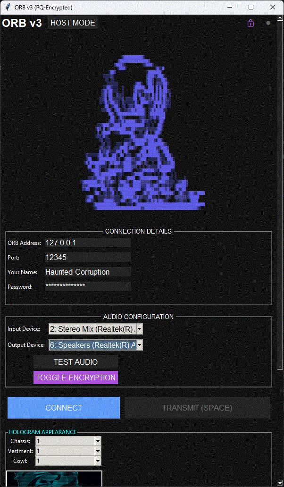

# ORB v3 - Post-Quantum Encrypted Voice Chat 🌀🔒

<p align="center">
  
</p>


## What is ORB v3? 🌟

ORB v3 is a **secure, peer-to-peer voice communication tool** with built-in **post-quantum encryption** using ML-KEM-1024. It creates a virtual "chamber" where participants can communicate with encrypted audio and customize holographic avatars.

Key features:
- 🎙️ Real-time voice communication
- 🔐 Quantum-resistant encryption
- 👥 Participant management with custom names
- 🎭 Unique holographic avatar system
- 🌐 Both host/client modes
- 📊 Visual activity indicators


## Quick Start 🚀

### Prerequisites
- Python 3.8+
- Required packages:
  
```bash
pip install pyaudio numpy pillow cryptography quantcrypt
```

  ### Running ORB

1. Clone this repository

```bash
git clone https://github.com/lewallen4/orb
```

3. Run the application:
 
```bash
python orb_v3.py
```

3. Choose your mode:

    Host Mode 🏰: Create a chamber for others to join

    Client Mode 👤: Connect to an existing chamber


## How It Works 🛠️ 


### Technical Architecture

#### ORB v3 uses a hybrid architecture 🔮

- UDP Networking: For low-latency voice transmission
- ML-KEM-1024: Post-quantum key exchange
- AES-256-GCM: For encrypted audio streams
- PyAudio: Cross-platform audio handling
- Tkinter: Modern GUI with dark theme

#### Encryption Flow 🔐

1. Key Exchange: ML-KEM-1024 establishes session keys
2. Audio Encryption: AES-256-GCM encrypts all audio data
3. Key Rotation: Regular key updates for forward secrecy

#### Avatar System 👾

Participants can customize their holographic appearance with:
- 3 Chassis options
- 3 Vestment styles
- 3 Cowl designs

## Network Setup Tips 📡

#### For best results, ensure:

- Port forwarding is enabled (default: 12345)
- Firewall allows UDP traffic
- NAT traversal is configured

## Troubleshooting 🆘

#### Common issues:

- No audio devices found: Check microphone permissions
- Connection failures: Verify host IP/port and password
- Encryption errors: Try disabling/re-enabling encryption

## Future Roadmap 🌈

#### Planned enhancements:

- More avatar options
- A messageboard for dank memes
- Hash based encryption verification
- External connection verification detections

## Contributing 🤝

#### We welcome contributions! Please:

1. Fork the repository
2. Create a feature branch
3. Submit a pull request

## License 📜

This project uses several open-source components:
- [ORB v3](https://github.com/yourusername/orb-v3): [MIT](LICENSE.md)
- [PyAudio](https://people.csail.mit.edu/hubert/pyaudio/): [MIT](https://people.csail.mit.edu/hubert/pyaudio/#license)
- [NumPy](https://numpy.org): [BSD-3-Clause](https://numpy.org/license/)
- [Pillow (PIL Fork)](https://python-pillow.org): [HPND](https://github.com/python-pillow/Pillow/blob/master/LICENSE)
- [Cryptography](https://cryptography.io): [Apache 2.0](https://github.com/pyca/cryptography/blob/main/LICENSE)
- [QuantCrypt](https://github.com/randombit/quantcrypt): [MIT](https://github.com/randombit/quantcrypt/blob/master/LICENSE)
- [Python](https://www.python.org): [PSF License](https://docs.python.org/3/license.html)

All dependencies are used in compliance with their respective licenses.

---

"What the void calls eternity, we call intermission" 🔮
